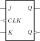

# Clock-Triggered RS Flip-flop

We have discussed the [basic RS flip-flop](../rs-flip-flop/) that
can remember one bit of information. If we add two **NAND** gates to it, then we control the on/off state of flip-flop:

Now we have a **clock-triggered flip-flop**. Here, the $CLK$ is 
an `on/off` signal:

* $CLK = 0$, **component is turn off**
  
  We obtain $
  \begin{cases} S_D = \overline{0\cdot S} = 1 \\\\ R_D = \overline{0 \cdot R} = 1 \end{cases}
  $ , and the RS Flip-flop does not respond to any changes in
  input.
  
  
* $CLK = 1$, **component is working**
  
  We obtain $
  \begin{cases} S_D = \overline{1\cdot S} = \overline{S} \\\\ R_D = \overline{1 \cdot R} = \overline{R} \end{cases}
  $ , the RS Flip-flop responds to any changes of input.

We can obtain $Q^{next}$ from basic RS flip-flop when
$CLK$ is in the high-level:

$$
\begin{aligned}
Q^{next} &= \overline{S_D} + R_D Q^n \\\\
         &= S + \overline{R} Q^n & (S_D=\overline{S}, R_D=\overline{R})
\end{aligned}
$$

And its constraint cases:

$$
\begin{aligned}
R_D + S_D &= 1 \\\\
\overline{R} + \overline{S} &= 1 \\\\
\overline{\overline{R} + \overline{S}} &= \overline{1} \\\\
RS &= 0
\end{aligned}
$$

Thus, we can obtain the state equation of the clock-triggered
RS flip-flop:

$$
\begin{cases}
Q^{next} = S + \overline{R}Q^n \\\\
RS = 0 & (Constraint)
\end{cases}
$$

Then we can write the state transition table from its state
equation:

| $S$|$R$ | $Q^{next}$| Comment |
|:---|:---|:---------:|:--------|
| 0  | 0  |   $Q$     |  Retain |
| 0  | 1  |   0       |  Reset  |
| 1  | 0  |   1       |  Preset |
| 1  | 1  | $\times$   |  Invalid|

Here are the explanations for input signals:

* $S$: high-level effective, **Preset** signal
* $R$: high-level effective, **Reset** signal

The clock-triggered RS flip-flop can control its on/off
state by the $CLK$ signal, but it still requires attention to
make the inputs satisfy $RS = 0$.

After adding some extra logical gates on
the RS flip-flop, we can satisfy this constraint by default，
that is the following flip-flops we will discuss: D flip-flop,
T flip-flop and JK-flip-flop.

# D Flip-flop

A D flip-flop is constructed by adding a **NOT** gate to an RS
flip-flop and connecting $S$ and $R$ to the input $D$:

We can obtain the inputs of the RS flip-flop as follows: $
\begin{cases}
S = D \\\\
R = \overline{D}
\end{cases}
$, From this, we know that the D flip-flop satisfies the constraint
$RS=\overline{D}D = 0$, We can obtain the state equation of
the D flip-flop from the RS flip-flop:

$$
\begin{aligned}
Q^{next} &= S + \overline{R}Q^n \\\\
         &= D + \overline{\overline{D}}Q^n \\\\
         &= D
\end{aligned}
$$

Thus, the state equation of the D flip-flop is $Q^{next} = D$, and its state transition table is:

| $D$  | $Q^{next}$ |
|-----:|-----------:|
|  0   |       0    |
|  1   |       1    |

The next state of the D flip-flop only depends on its inputs 
$D$. When the flip-flop is triggered by an edge,
it **_Delays_** the input $D$ by one clock cycle.

# T Flip Flop

A T Flip flop adds two **AND** gates to an RS flip-flop but is
controlled by a single signal $T$, it can used to **_Toggle_**
the output:

The inputs for the RS flip-flop are now controlled by the signal
$T$ as follows: $
\begin{cases}
S = T\overline{Q^n} \\\\
R = TQ^n
\end{cases}
$, for the inner RS flip-flop, it still satisfies the constraint $RS= TQ\cdot T\overline{Q} = 0$.

We can obtain the state equation of T flip-flop from the inner RS
flip-flop:

$$
\begin{aligned}
Q^{next} &=  S + \overline{R}Q^n \\\\
         &=  T\overline{Q^n} + \overline{TQ^n}Q^n \\\\
         &=  T\overline{Q^n} + \overline{T}Q^n +
             \overline{Q^n}Q^n \\\\
         &=  T\overline{Q^n} + \overline{T}Q^n \\\\
         &=  T \oplus Q^n
\end{aligned}
$$

We can then list its state transition table from the state 
equation :

| $T$  | $Q^{next}$ |  Comment |
|------|------------|----------|
|  0   |   $Q$      |  Retain  |
|  1   | $\overline{Q}$ | Toggle |

# JK Flip Flop

Similar to the T flip-flop, the JK flip-flop add two **AND** 
gates on the RS flip-flop, but this time controlled by two
input signals, $J$ and $K$:

We can derive the inputs for the inner RS flip-flop as: $
\begin{cases}
S = J\overline{Q^n} \\\\
R = KQ^n
\end{cases}
$, and it satisfies the constraint $RS= KQ^n\cdot J\overline{Q^n}  = 0$.

Let's derive the state equation of the JK flip-flop from the inner RS flip-flop:

$$
\begin{aligned}
Q^{next} &=  S + \overline{R}Q^n \\\\
         &=  J\overline{Q^n} + \overline{KQ^n}Q^n \\\\
         &=  J\overline{Q^n} + \overline{K}Q^n + \overline{Q^n}Q^n \\\\
         &= J\overline{Q^n} + \overline{K}Q^n
\end{aligned}
$$

The state transition table is as follows:

| $J$  | $K$ | $Q^{next}$      | Comment  |
|:----:|:---:|:---------------:|:--------:|
|   0  |   0 |  $Q^n$          |  Obtain  |
|   0  |   1 |   0             |  Reset   |
|   1  |   0 |   1             |  Preset  |
|   1  |   1 | $\overline{Q^n}$|  Toggle  |

We can see that the JK flip-flop has all the functions of the D flip-flop, RS flip-flop, and T flip-flop.

Logical Symbols
===============

These are the common symbols for flip-flops triggered by a clock:

<table>
  <tr>
    <td></td>
    <td></td>
    <td></td>
    <td></td>
  </tr>
</table>

For flip-flops that are triggered by a low-level clock signal, a circle is added to the input $CLK$:

<table>
  <tr>
    <td></td>
    <td></td>
    <td></td>
    <td></td>
  </tr>
</table>

The flip-flop will only update $Q^{next}$ when the clock is effective.

If the flip-flop is triggered at the edge of the clock signal, a triangle is added to the input $CLK$:

<table>
  <tr>
    <td></td>
    <td></td>
    <td></td>
    <td></td>
  </tr>
</table>

The flip-flop will only update $Q^{next}$ at the edge of the $CLK$ signal.

Asynchronous Flip-Flop Signals
==============================

The flip-flops discussed so far compute the $Q^{next}$
when the $CLK$ signal is effective. By adding two input
signals, we can control $Q^{next}$ without relying on
the $CLK$ signal.

<table>
  <tr>
    <td></td>
    <td></td>
    <td></td>
  </tr>
</table>

The $PRE$ and $CLS$ are asynchronous signals that 
have higher priority than other inputs and are not 
controlled by the clock signal. These signal can ignore other
inputs to flip-flop and update $Q^{next}$ forcibly.

* $PRE=1$ and $CLS=1$, the flip-flop works normally.
* $PRE=1$ and $CLS=0$, reset $Q$ to 0 forcibly.
* $PRE=0$ and $CLS=1$, preset $Q$ to 1 forcibly.
* $PRE=0$ and $CLS=0$, invalid input, may cause unstable output.

## A Possible implement

We can modify the flip-flop circuit by adding extra gates on the last level of the flip-flop as shown below:

After analyzing the function, we can design a combinational circuit that satisfies the following conditions:

* $PRE=1$ and $CLS=1$, the flip-flop works normally.
  
  $\Rightarrow$ $S_D = S_D^{'}$, $R_D = R_D{'}$

* $PRE=1$ and $CLS=0$, the circuit resets $Q$ to 0.
  
  $\Rightarrow$ $S_D = 1$, $R_D = 0$

* $PRE=0$ and $CLS=1$, the circuit presets $Q$ to 1.

  $\Rightarrow$ $S_D = 0$, $R_D = 1$

* $PRE=0$ and $CLS=0$, invalid input and may cause unstable output.

  $\Rightarrow$ $S_D = 0$, $R_D = 0$

We can use the truth table to derive the boolean expression for the $S_D$ signal from the above discussion:

| $PRE$ | $CLS$ | $S_{D}^{'}$ | $S_D$ | Comment |
|:-----:|:-----:|:-----------:|:-----:|:-------:|
|   0   |   0   |     0       |   0   | Invalid |
|   0   |   0   |     1       |   0   | Invalid |
|   0   |   1   |     0       |   0   | Preset  |
|   0   |   1   |     1       |   0   | Preset  |
|   1   |   0   |     0       |   1   | Reset   |
|   1   |   0   |     1       |   1   | Reset   |
|   1   |   1   |     0       |   0   | Working |
|   1   |   1   |     1       |   1   | Working |

The boolean expression for $S_D$ is:

$$
\begin{aligned}
S_D &= PRE \cdot \overline{CLS} \cdot \overline{S_D^{'}}
     + PRE \cdot \overline{CLS} \cdot S_D^{'}
     + PRE \cdot CLS \cdot S_D^{'} \\\\
    &= PRE \cdot \overline{CLS} \cdot \overline{S_D^{'}}
     + PRE \cdot \overline{CLS} \cdot S_D^{'}
     + PRE \cdot \overline{CLS} \cdot S_D^{'}
     + PRE \cdot CLS \cdot S_D^{'} \\\\
    &= (PRE \cdot \overline{CLS} \cdot \overline{S_D^{'}}
     + PRE \cdot \overline{CLS} \cdot S_D^{'})
     + (PRE \cdot \overline{CLS} \cdot S_D^{'}
     + PRE \cdot CLS \cdot S_D^{'}) \\\\
    &= PRE \cdot \overline{CLS}
     + PRE \cdot S_D^{'}
\end{aligned}
$$

Similarly, we can derive the boolean expression for the $R_D$ signal using the truth table below:

| $PRE$ | $CLS$ | $R_{D}^{'}$ | $R_D$ | Comment |
|:-----:|:-----:|:-----------:|:-----:|:-------:|
|   0   |   0   |     0       |   0   | Invalid |
|   0   |   0   |     1       |   0   | Invalid |
|   0   |   1   |     0       |   1   | Preset  |
|   0   |   1   |     1       |   1   | Preset  |
|   1   |   0   |     0       |   0   | Reset   |
|   1   |   0   |     1       |   0   | Reset   |
|   1   |   1   |     0       |   0   | Working |
|   1   |   1   |     1       |   1   | Working |

The boolean expression for $R_D$ is:

$$
\begin{aligned}
R_D &= \overline{PRE} \cdot CLS \cdot \overline{R_D^{'}}
    +  \overline{PRE} \cdot CLS \cdot R_D^{'}
    +  PRE \cdot CLS \cdot R_D^{'} \\\\
    &= \overline{PRE} \cdot CLS \cdot \overline{R_D^{'}}
    +  \overline{PRE} \cdot CLS \cdot R_D^{'}
    +  \overline{PRE} \cdot CLS \cdot R_D^{'}
    +  PRE \cdot CLS \cdot R_D^{'} \\\\
    &= (\overline{PRE} \cdot CLS \cdot \overline{R_D^{'}}
    +  \overline{PRE} \cdot CLS \cdot R_D^{'})
    +  (\overline{PRE} \cdot CLS \cdot R_D^{'}
    +  PRE \cdot CLS \cdot R_D^{'}) \\\\
    &= \overline{PRE} \cdot CLS + CLS \cdot R^{'}_D
\end{aligned}
$$