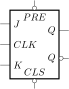

# Clock-Triggered RS Flip-flop

We have discussed the [basic RS flip-flop](../rs-flip-flop/) that
can remember one bit information. If we add two **NAND** gates on
it, then we can control the on/off state of flip-flop:

Now we get a **clock-triggered flip-flop**. Here the $CLK$ is a
`on/off` signal:

* $CLK = 0$, **component is turn off**
  
  Obtaining $
  \begin{cases} S_D = \overline{0\cdot S} = 1 \\\\ R_D = \overline{0 \cdot R} = 1 \end{cases}
  $ , the RS Flip flop doesn't respond the changes from input.
  
  
* $CLK = 1$, **component is working**
  
  Obtaining $
  \begin{cases} S_D = \overline{1\cdot S} = \overline{S} \\\\ R_D = \overline{1 \cdot R} = \overline{R} \end{cases}
  $ , the RS Flip flop responds the changes of input

Now we can obtain $Q^{next}$ from basic RS flip-flop when
$CLK$ is high-level:

$$
\begin{aligned}
Q^{next} &= \overline{S_D} + R_D Q^n \\\\
         &= S + \overline{R} Q^n & (S_D=\overline{S}, R_D=\overline{R})
\end{aligned}
$$

Constraint cases:

$$
\begin{aligned}
R_D + S_D &= 1 \\\\
\overline{R} + \overline{S} &= 1 \\\\
\overline{\overline{R} + \overline{S}} &= \overline{1} \\\\
RS &= 0
\end{aligned}
$$

So we can obtain state equation of the clock triggered RS
flip-flop:

$$
\begin{cases}
Q^{next} = S + \overline{R}Q^n \\\\
RS = 0 & (Constraint)
\end{cases}
$$

Then we can write state transition table from its state equation:

| $S$|$R$ | $Q^{next}$| Comment |
|:---|:---|:---------:|:--------|
| 0  | 0  |   $Q$     |  Retain |
| 0  | 1  |   0       |  Reset  |
| 1  | 0  |   1       |  Preset |
| 1  | 1  | $\times$   |  Invalid|

There are explanation for signals:

* $S$: high-level effective, **Preset** signal
* $R$: high-level effective, **Reset** signal

The clock-triggered RS-flip-flop can control its on/off
state by $CLK$ signal, but it still take attention to make
inputs to satisfy $RS = 0$.

After add some extra logical gates on
RS flip-flop, we can to satisfy this constraint by default，
that's  following flip-flops we will discuss: D flip-flop,
T flop-flop and JK-flip-flop.

# D Flip-flop

The D flip-flop add a **NOT** gate in RS flip-flop and connect $S$ and $R$:

We can obtain the inputs of RS flip-flop: $
\begin{cases}
S = D \\\\
R = \overline{D}
\end{cases}
$, then we know D flip-flop satisfy the constraint
$RS=\overline{D}D = 0$, We can obtain State Equation of
D flip-flop from RS flip-flop:

$$
\begin{aligned}
Q^{next} &= S + \overline{R}Q^n \\\\
         &= D + \overline{\overline{D}}Q^n \\\\
         &= D
\end{aligned}
$$

Now we can obtain the State Equation of D flip-flop is $Q^{next} = D$,  and its state
transition table:

| $D$  | $Q^{next}$ |
|-----:|-----------:|
|  0   |       0    |
|  1   |       1    |

The next state of D flip-flop only depends on its inputs, when
flip-flop is triggered by edge, it can **_Delay_** the input $D$
in a cycle.

# T Flip Flop

T Flip flop add two **AND** gates on RS flip flop and but
controlled by one signal $T$, it can used to **_Toggle_** the
output:

Inputs for RS flip flop is controlled by signal $T$ now: $
\begin{cases}
S = T\overline{Q^n} \\\\
R = TQ^n
\end{cases}
$, for inner RS flip-flop, it also satisfy constraint $RS= TQ\cdot T\overline{Q} = 0$.

We can obtain State equation of T flip-flop from inner RS
flip-flop:

$$
\begin{aligned}
Q^{next} &=  S + \overline{R}Q^n \\\\
         &=  T\overline{Q^n} + \overline{TQ^n}Q^n \\\\
         &=  T\overline{Q^n} + \overline{T}Q^n +
             \overline{Q^n}Q^n \\\\
         &=  T\overline{Q^n} + \overline{T}Q^n \\\\
         &=  T \oplus Q^n
\end{aligned}
$$

And list its state transition table:

| $T$  | $Q^{next}$ |  Comment |
|------|------------|----------|
|  0   |   $Q$      |  Retain  |
|  1   | $\overline{Q}$ | Toggle |

# JK Flip Flop

Just like T flip flop, JK flip flop add two **AND** Gate on RS
flip-flop, but controlled by two input signal $J$ and $K$:

We can obtain the inputs for inner RS flip flop: $
\begin{cases}
S = J\overline{Q^n} \\\\
R = KQ^n
\end{cases}
$, and we can infer that it satisfy the constraint  $RS= KQ^n\cdot J\overline{Q^n}  = 0$.

Let's infer state equation of JK flip-flop from inner RS
flip-flop:

$$
\begin{aligned}
Q^{next} &=  S + \overline{R}Q^n \\\\
         &=  J\overline{Q^n} + \overline{KQ^n}Q^n \\\\
         &=  J\overline{Q^n} + \overline{K}Q^n + \overline{Q^n}Q^n \\\\
         &= J\overline{Q^n} + \overline{K}Q^n
\end{aligned}
$$

State Transition Table:

| $J$  | $K$ | $Q^{next}$      | Comment  |
|:----:|:---:|:---------------:|:--------:|
|   0  |   0 |  $Q^n$          |  Obtain  |
|   0  |   1 |   0             |  Reset   |
|   1  |   0 |   1             |  Preset  |
|   1  |   1 | $\overline{Q^n}$|  Toggle  |

We can see that JK-flip flop have all functions from D flip-flop,
RS flip-flop and T flip-flop.

Symbols
=======

This is common symbols of flip-flop triggered by clock:

<table>
  <tr>
    <td></td>
    <td></td>
    <td></td>
    <td></td>
  </tr>
</table>

For flip-flop effective in low-level clock signal, add a circle on input $CLK$:

<table>
  <tr>
    <td></td>
    <td></td>
    <td></td>
    <td></td>
  </tr>
</table>

The flip-flop will only update $Q^{next}$ when
clock is effective.

If flip-flop is effective in edge of clock signal, add triangle on input $CLK$:

<table>
  <tr>
    <td></td>
    <td></td>
    <td></td>
    <td></td>
  </tr>
</table>

The flip-flop will only update $Q^{next}$ on
edge of $CLK$ signal.

Asynchronous Flip-Flop
======================

Above flip-flop we discussed only compute $Q^{next}$ only when 
signal $CLK$ effective. If we add two input signal , we can control output without
$CLK$ signal.

<table>
  <tr>
    <td></td>
    <td></td>
    <td></td>
  </tr>
</table>

The $PRE$ and $CLS$ are asynchronous signals, 
they have higher priority than clock and other inputs and don't 
controlled by clock signal, which can ignore other inputs
of flip-flop and update $Q^{next}$ directly.

* $PRE=1$ and $CLS=1$, the flip-flop works normally.
* $PRE=1$ and $CLS=0$, reset $Q$ to 0.
* $PRE=0$ and $CLS=1$, preset $Q$ to 1.
* $PRE=0$ and $CLS=0$, invalid input, may cause unstable output.

## A Possible implement

Lets add extra gates on last level of flip-flop:

After analyze the functions. We can design a combinational circuit to satisfy:

* $PRE=1$ and $CLS=1$, the flip-flop works normally.
  
  $\Rightarrow$ $S_D = S_D^{'}$, $R_D = R_D{'}$

* $PRE=1$ and $CLS=0$, reset $Q$ to 0.
  
  $\Rightarrow$ $S_D = 1$, $R_D = 0$

* $PRE=0$ and $CLS=1$, preset $Q$ to 1.

  $\Rightarrow$ $S_D = 0$, $R_D = 1$

* $PRE=0$ and $CLS=0$, invalid input, may cause unstable output.

  $\Rightarrow$ $S_D = 0$, $R_D = 0$

Then we can list the truth table and inter its boolean
expression for $S_D$ signal:

| $PRE$ | $CLS$ | $S_{D}^{'}$ | $S_D$ | Comment |
|:-----:|:-----:|:-----------:|:-----:|:-------:|
|   0   |   0   |     0       |   0   | Invalid |
|   0   |   0   |     1       |   0   | Invalid |
|   0   |   1   |     0       |   0   | Preset  |
|   0   |   1   |     1       |   0   | Preset  |
|   1   |   0   |     0       |   1   | Reset   |
|   1   |   0   |     1       |   1   | Reset   |
|   1   |   1   |     0       |   0   | Working |
|   1   |   1   |     1       |   1   | Working |

$$
\begin{aligned}
S_D &= PRE \cdot \overline{CLS} \cdot \overline{S_D^{'}}
     + PRE \cdot \overline{CLS} \cdot S_D^{'}
     + PRE \cdot CLS \cdot S_D^{'} \\\\
    &= PRE \cdot \overline{CLS} \cdot \overline{S_D^{'}}
     + PRE \cdot \overline{CLS} \cdot S_D^{'}
     + PRE \cdot \overline{CLS} \cdot S_D^{'}
     + PRE \cdot CLS \cdot S_D^{'} \\\\
    &= (PRE \cdot \overline{CLS} \cdot \overline{S_D^{'}}
     + PRE \cdot \overline{CLS} \cdot S_D^{'})
     + (PRE \cdot \overline{CLS} \cdot S_D^{'}
     + PRE \cdot CLS \cdot S_D^{'}) \\\\
    &= PRE \cdot \overline{CLS}
     + PRE \cdot S_D^{'}
\end{aligned}
$$

Infer signal $R_D$ correspondingly:

| $PRE$ | $CLS$ | $R_{D}^{'}$ | $R_D$ | Comment |
|:-----:|:-----:|:-----------:|:-----:|:-------:|
|   0   |   0   |     0       |   0   | Invalid |
|   0   |   0   |     1       |   0   | Invalid |
|   0   |   1   |     0       |   1   | Preset  |
|   0   |   1   |     1       |   1   | Preset  |
|   1   |   0   |     0       |   0   | Reset   |
|   1   |   0   |     1       |   0   | Reset   |
|   1   |   1   |     0       |   0   | Working |
|   1   |   1   |     1       |   1   | Working |

$$
\begin{aligned}
R_D &= \overline{PRE} \cdot CLS \cdot \overline{R_D^{'}}
    +  \overline{PRE} \cdot CLS \cdot R_D^{'}
    +  PRE \cdot CLS \cdot R_D^{'} \\\\
    &= \overline{PRE} \cdot CLS \cdot \overline{R_D^{'}}
    +  \overline{PRE} \cdot CLS \cdot R_D^{'}
    +  \overline{PRE} \cdot CLS \cdot R_D^{'}
    +  PRE \cdot CLS \cdot R_D^{'} \\\\
    &= (\overline{PRE} \cdot CLS \cdot \overline{R_D^{'}}
    +  \overline{PRE} \cdot CLS \cdot R_D^{'})
    +  (\overline{PRE} \cdot CLS \cdot R_D^{'}
    +  PRE \cdot CLS \cdot R_D^{'}) \\\\
    &= \overline{PRE} \cdot CLS + CLS \cdot R^{'}_D
\end{aligned}
$$