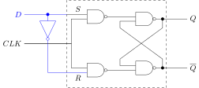
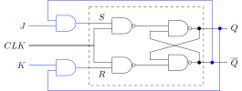

# Clock-Triggered RS Flip-flop

* $CLK = 0$, obtaining $
  \begin{cases} S_D = \overline{0\cdot S} = 1 \\\\ R_D = \overline{0 \cdot R} = 1 \end{cases}
  $ , RS Flip flop don't response the changes of input (**showdown**)
* $CLK = 1$, obtaining $
  \begin{cases} S_D = \overline{1\cdot S} = \overline{S} \\\\ R_D = \overline{1 \cdot R} = \overline{R} \end{cases}
  $ , RS Flip flop start respond the changes of input (**working**)

# D Flip Flop

Inputs for RS flip flop: $
\begin{cases}
S = D \\\\
R = \overline{D}
\end{cases}
$

$RS=\overline{D}D = 0$

$$
\begin{aligned}
Q^{next} &= S + \overline{R}Q^n \\\\
         &= D + \overline{\overline{D}}Q^n \\\\
         &= D
\end{aligned}
$$

$Q^{next} = D$

# T Flip Flop

Inputs for RS flip flop: $
\begin{cases}
S = T\overline{Q^n} \\\\
R = TQ^n
\end{cases}
$

$RS= TQ\cdot T\overline{Q} = 0$

$$
\begin{aligned}
Q^{next} &=  S + \overline{R}Q^n \\\\
         &=  T\overline{Q^n} + \overline{TQ^n}Q^n \\\\
         &=  T\overline{Q^n} + \overline{T}Q^n +
             \overline{Q^n}Q^n \\\\
         &=  T\overline{Q^n} + \overline{T}Q^n \\\\
         &=  T \oplus Q^n
\end{aligned}
$$

# JK Flip Flop

Inputs for RS flip flop: $
\begin{cases}
S = J\overline{Q^n} \\\\
R = KQ^n
\end{cases}
$

$RS= KQ^n\cdot J\overline{Q^n}  = 0$

$$
\begin{aligned}
Q^{next} &=  S + \overline{R}Q^n \\\\
         &=  J\overline{Q^n} + \overline{KQ^n}Q^n \\\\
         &=  J\overline{Q^n} + \overline{K}Q^n + \overline{Q^n}Q^n \\\\
         &= J\overline{Q^n} + \overline{K}Q^n
\end{aligned}
$$