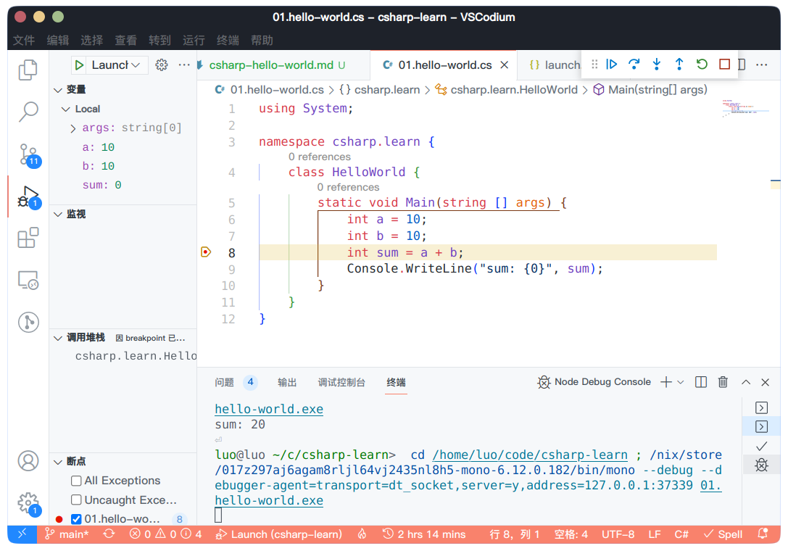

自己在 NixOS 上学习 C# 的一些笔记。

## 安装 Mono 和 .Net SDK

C# 在 .Net 之上运行，安装 .Net SDK：

```bash
nix-shell -p dotnetCorePackages.sdk_6_0 mono
```

## Hello World

C# 的程序结构一般长这样，以 cs 作为拓展名：

```csharp
// hello_world.cs
using System;

namespace com.example {
    class HelloWorld {
        static void Main(string[] args) {
            Console.WriteLine("Hello World");
        }
    }
}
```

C# 的语法结构和 Java、C++ 类似：

- using 可以用来导入命名空间
- 程序的入口是 Main 函数，这里的语法和 Java 类似
- Console.WriteLine 方法类似于 C 里的 printf，这个方法从 System 命名空间里引入

## 编译执行

安装 mono 使用 csc 编译程序：

```
csc hello_world.cs
```

编译通过后会在当前目录生成 hello_world.exe：

```
$ file hello_world.exe 
hello_world.exe: PE32 executable (console) Intel 80386 Mono/.Net assembly, for MS Windows
```

运行：

```
$ mono hello_world.exe
Hello World
```

## Vscode 插件

主要安装两个插件：

- C#
- Mono Debug

C# 插件其实有调试功能，但这个功能只能在 Windows 里使用，在 Linux 下需要安装 Mono Debug 来进行调试。

```nix
environment.systemPackages = with pkgs; [
  (vscode-with-extensions.override {
    vscode = vscodium;
    vscodeExtensions = with vscode-extensions; [
      vscode-extensions.ms-dotnettools.csharp
    ] ++ pkgs.vscode-utils.extensionsFromVscodeMarketplace [
      {
        name = "mono-debug";
        publisher = "ms-vscode";
        version = "0.16.3";
        sha256 = "sha256-6IU8aP4FQVbEMZAgssGiyqM+PAbwipxou5Wk3Q2mjZg=";
      }
    ];
  })
];
```

## Debug

主要参考了 CSDN 上的文章：https://blog.csdn.net/qinyuanpei/article/details/57419539

tasks.json：以 -debug 模式编译 c# 源文件

```json
{
    // See https://go.microsoft.com/fwlink/?LinkId=733558
    // for the documentation about the tasks.json format
    "version": "2.0.0",
    "tasks": [
        {
            "label": "build", // 用来标识任务
            "command": "csc", // 运行 csc -debug ${file} 编译文件
            "type": "shell",
            "args": [
                "-debug",
                "${file}"     // ${file} 将被替换成源文件的路径
            ],
        }
    ]
}
```

launch.json：通过 mono debug 插件进行调试

```json
{
    "version": "0.2.0",
    "configurations": [
        {
            "type": "mono",
            "name": "Launch",
            "request": "launch",
            "program": "${fileDirname}/${fileBasenameNoExtension}.exe", 
            "cwd": "${workspaceFolder}",
            "preLaunchTask": "build",
            "runtimeExecutable": "mono",
            "console": "integratedTerminal",
        }
    ]
}
```

如果 vscode 报错提示找不到 mono runtime，可以将 runtimeExecutable 设置成 mono 的绝对路径

就可以在源文件里设置断点，F5 调试了：

