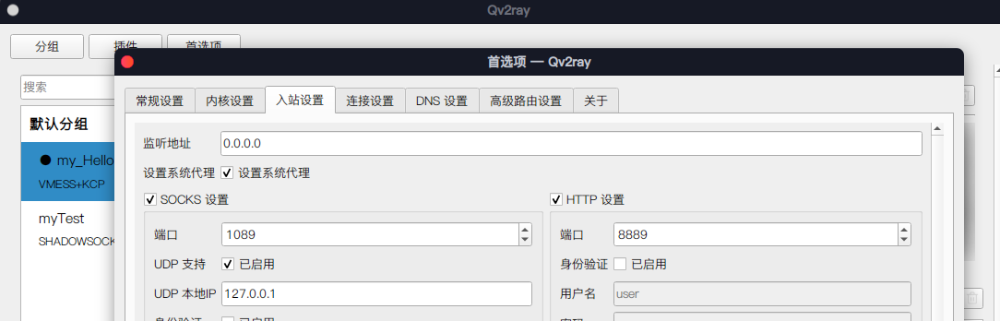

> An installation guide for Anbox based on the Arch Wiki:
> Wiki link: [https://wiki.archlinux.org/title/Anbox](https://wiki.archlinux.org/title/Anbox)

## Installing Kernel Modules

You will need to switch to the `linux-tls` kernel:

```bash
sudo pacman -S linux-lts linux-lts-headers
sudo grub-mkconfig -o /boot/grub/grub.cfg
```

Install the kernel modules:

```bash
yay -S anbox-modules-dkms
```

Load the kernel modules:

```bash
sudo modprobe binder_linux devices=binder,hwbinder,vndbinder,anbox-binder,anbox-hwbinder,anbox-vndbinder
sudo modprobe ashmem_linux
sudo mkdir -p /dev/binderfs
sudo mount -t binder binder /dev/binderfs
```

Edit `/etc/modules-load.d/anbox.conf` to enable the kernel modules at boot time:

```bash
ashmem_linux
binder_linux
```

Edit `/etc/tmpfiles.d/anbox.conf` and add the following line to mount `binderfs` at boot:

```bash
# /etc/tmpfiles.d/anbox.conf
d! /dev/binderfs 0755 root root
```

Add the following line to the end of `/etc/fstab`:

```bash
none                         /dev/binderfs binder   nofail  0      0
```

## Anbox Installation

Install Anbox using the `ArchlinuxCN` repository:

```bash
sudo pacman -S anbox-git anbox-image
```

Set up the network. Since I use `NetworkManager` as my network manager, I only need to configure Anbox's network like this:

```bash
nmcli con add type bridge ifname anbox0 -- connection.id anbox-net ipv4.method shared ipv4.addresses 192.168.250.1/24
```

You only need to do this once. NetworkManger will automatically configure the network at startup. Refer to Arch Wiki for other ways to configure the network.

Enable the service:

```bash
sudo systemctl start anbox-container-manager.service  # start
sudo systemctl enable anbox-container-manager.service # set to start at boot
```

Check the Anbox status. If it is displayed as running, there should be no major issues:

```
sudo systemctl status anbox-container-manager.service
```

Now you can see the Anbox interface by clicking on the Anbox icon on the desktop.

## Application Installation

Make sure the `adb` command exists:

```
sudo pacman -S android-tools
```

Then use `adb install` to install the app:

```
adb install /path/to/app.apk
```

## ARM Support

Currently, it doesn't seem to be very useful. Some APKs of ARM architecture can be installed, but cannot be started.

### Pre-installation Preparation

First, install some dependencies:

```bash
sudo pacman -S squashfs-tools tar unzip curl wget lzip 
```

> The following content may become outdated in the future, it is recommended to refer to the original project address: [https://github.com/geeks-r-us/anbox-playstore-installer](https://github.com/geeks-r-us/anbox-playstore-installer)

The installation script for ARM cannot be used directly on Arch, manual intervention is required before that. You need to manually modify the `/usr/lib/systemd/system/anbox-container-manager.service` file and add `--use-rootfs-overlay` at the end of the `ExecStart` line. The modified file looks like this:

```conf
[Unit]
Description=Anbox Container Manager

[Service]
ExecStart=/usr/bin/anbox container-manager --daemon --privileged --data-path=/var/lib/anbox --use-rootfs-overlay

[Install]
WantedBy=multi-user.target
```

Then, restart the Anbox service:

```bash
systemctl daemon-reload
systemctl restart anbox-container-manager.service
```

### Installation

Next, you only need to download the script and run it. This process requires downloading some files, which may require crossing the GFW:

```bash
mkdir a
cd a
wget https://raw.githubusercontent.com/geeks-r-us/anbox-playstore-installer/master/install-playstore.sh
chmod +x install-playstore.sh
./install-playstore.sh
```

If everything goes well, when you open Anbox, you should be able to find an additional Google Play Store, and APKs of ARM architecture can also be installed successfully.


## Proxy settings

### Setting up proxy

The host is using Qv2ray for proxy, which by default listens on 127.0.0.1. At this point, Anbox cannot access the proxy server on the computer. The solution is simple: click `Preferences` on the main interface and change the `Listening address` in `Inbound settings` to `0.0.0.0`:



Now, setting up the proxy through adb should work:

```bash
adb shell settings put global http_proxy <ip>:<port>
```


### Cancelling the proxy

```bash
adb shell settings put global http_proxy :0
```
