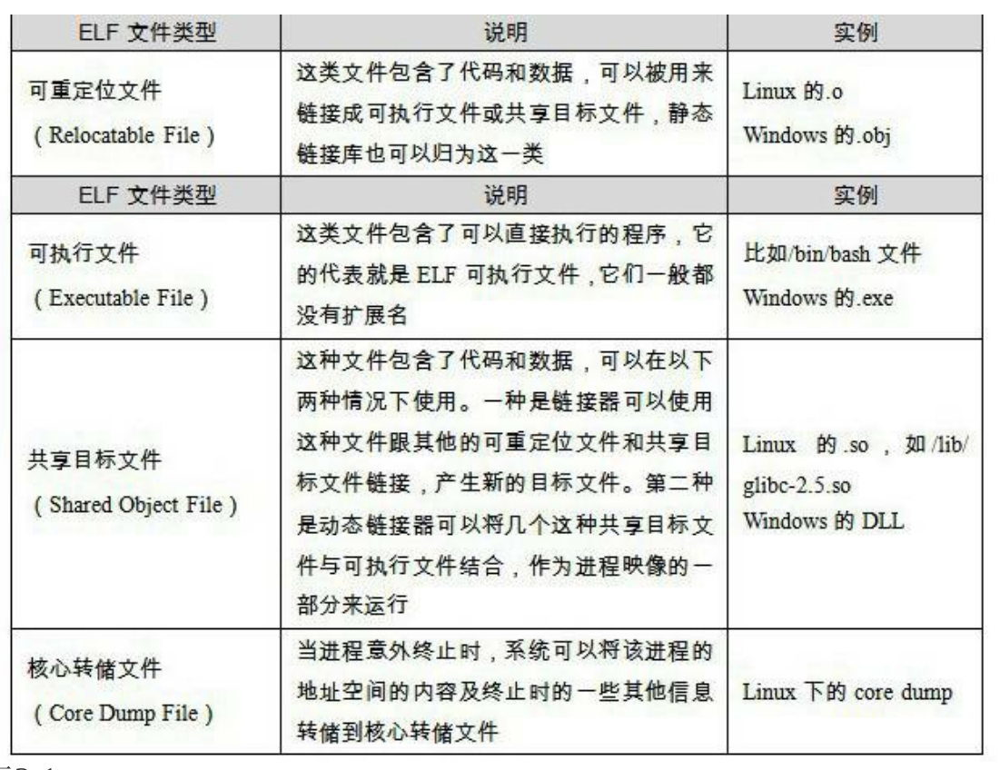

# 第一章 温故而知新

## CPU、内存和 IO 控制芯片
对于普通的程序开发者：大多时候关心 CPU，不用关心其他硬件细节；Java、Python、脚本语言开发者：CPU 也无需关心，编程语言已经提供了一个通用、无关平台的虚拟机。

## 计算机的硬件模型

* 早期
  
  CPU的频率很低、与内存差不多

  CPU、内存和其他设备连接到总线（Bus）上，每个IO设备有单独的控制芯片

* 南桥和北桥
  
  CPU 的频率高于内存频率，产生了与内存频率一致的系统总线。CPU 以倍频的方式与系统总线通信

  **北桥**：与 GPU 等高速设备通信

  **南桥**：与鼠标、键盘等低速设备通信

## 多核、SMP

* **对称多处理器（SMP）**：增加 CPU 的数量
* **多核处理器(Multi-core Processor)**：CPU内部共享缓存、保留多个核心

## 分层结构

每层之间相互通信，制定的通信协议：**接口** ，精心设计，尽量稳定

* 接口的下一层：提供接口
* 接口的上一层：使用接口

下层给上层提供服务

* API：运行库提供的接口（WindowsAPI、POSIX）
* 系统调用：操作系统提供的接口、往往以软件中断的形式提供（Linux int 0x80/ Windows 0x2E）

## 操作系统

和硬件打交道（驱动程序），屏蔽硬件细节，为上层的应用程序提供了使用硬件的接口

* Unix：被抽象成一系列文件，以文件的形式存在
* Windows：图形硬件——GDI；声音、多媒体——DirectX对象、磁盘——普通文件系统……

## 内存管理

早期，程序直接访问物理内存。进程之间的内存没有进行相互隔离。（进程A可以随意更改进程B的内容（Dos中一个程序可以随意更改任意内存，可以直接破坏操作系统本身的运行））

**程序需要的内存大约实际的物理内存时，该怎么办？** 将其他程序的数据暂时写入到磁盘里（换入和换出）

直接访问物理内存的缺点：

1. 地址空间不隔离：随意破坏和改写其他进程
2. 内存使用效率低：因为程序所使用的内存是**连续的**，在将空间进程的数据写入硬盘时，可能会导致大量数据的在硬盘中换入换出
3. 程序的运行地址不确定：程序在载入内存运行时，需要给它找一片空闲的内存。但这个空闲区域是不确定的。但程序在编写时，访问数据和跳转目标地址是固定的（地址在编译成二进制代码的时候已经固定了）——重定位

解决方案：添加中间层。将程序的地址（虚拟地址）映射到真实的物理地址。

好处：

**隔离** 进程有独立的地址空间（虚拟空间、可以看成一个很大的数组），只能访问到自己的地址空间

**分段映射** 一个程序进行需要多少内存，就从真实的物理地址里分配出等大小的一片区域，映射到进程的虚拟空间里（？）。物理内存的每一个字节和虚拟地址的每一个字节存在一一映射的关系。通常由硬件来完成

映射按程序为单位，内存不足时换入换出整个应用程序（粒度大）

> **局部性原理** 程序在运行时，大部分时间只会频繁地访问一小部分数据

**分页** 将地址空间划分成固定等大小的页，每页的大小由硬件决定

Intel 奔腾支持4KB或者4MB的页大小，但操作系统只能选择一种（4KB）

将页作为基本单位，将程序装载到内存、硬盘中：

* 虚拟页（Virtual Page, VP）：虚拟空间中的页
* 物理页（Physical Page, PP）：物理内存中的页
* 磁盘页（Disk Page, DP）：在磁盘中的页

**页错误** 进程需要的页不在内存中，硬件会捕获到这个消息，发错页错误，通知操作系统接管进程，从硬盘中载入对应的页。硬件本身就支持按页来存取、交换内存

**页面保护** 可以给每个页设置权限属性，且只有操作系统能够修改页的属性：保护自己、保护进程

**MMU（Memory Management Unit）** 实现虚拟存储的硬件，一般集成在 CPU 内部

**线程**

程序的一条执行路径。

线程=线程 ID+指令指针（PC）+寄存器集合+堆栈

进程共享的资源：程序的内存空间（代码段、数据段、堆）、进程级资源（打开的文件、信号）

进程私有资源：栈（一般认为是私有的，尽管其实可以被其他进程访问）、线程局部存储（Thread Local Storage, TLS）（操作系统提供，容量小）、寄存器（包括 PC 寄存器）

程序员的角度：

|  私有  | 共享   |
|:-------|:------|
| 局部变量| 全局变量 |
| 函数参数| 堆上的数据 |
| TLS 数据 | 函数里的静态变量 |
|          | 程序代码（代码段） |
|          | 打开的文件   |

进程调度：时间片轮转、优先级调度

设置优先级：

* Windows: `SetThreadPriority()` 函数
* Linux：设置 `pthread()` 的参数

操作系统会根据进程的表现自动调整优先级。

* IO 密集型线程：频繁等待的线程
* CPU 密集型线程：很少等待的线程

IO 密集型的线程更容易得到优先级的提升。

**饿死** 低优先级的进程总是被高优先级的进程抢占，自己没有办法运行。

* CPU 密集型的线程具有高优先级时，容易造成低优先级进程饿死（一直抢占CPU）
* IO 密集型型的线程会频繁进入等待状态，即使具有高优先级，低优先级的进程也有机会被运行

如何避免？进程的等待时间过长，优先级提升

## 抢占

进程被剥夺继续运行的权力（通常是时间片耗尽），进入就绪状态。

在早期的一些操作系统（Windows 3.1），进程是无法被抢占的，除非进程自己主动进入就绪状态

## Windows 与 Linux 的多线程支持

* Windows: 严格区分了线程和进程（`CreateProcess` / `CreateThread`）
* Linux: 支持贫乏、不存在真正意义上的线程概念——任务（Task，类似单进程的线程）
  * `fork` 复制当前进程，创建新进程
  * `exec` 使用新的可执行映像覆盖当前的可执行映像
  * `clone` 复制子进程并从指定位置开始执行

`clone` 可以在复制进程时，可以选择共享内存空间和打开文件，相当于创建了一个新线程
；`fork` 写时复制（COW, Copy on Write）

## 线程安全

* 竞争和原子操作：
  
  多个线程**同时读同一个全局变量**：安全

  多线程**同时写一个全局变量**：引发竞争问题（对于一个变量，每个线程中的值（寄存器中）**不同步**）

  exam：即使是简单的 `i++` 和 `i--` 也会引起竞争问题。有的体系结构会将这个操作分成三个指令：

  1. 从内存中读取 i，存入寄存器 `X`
  2. X++
  3. 将寄存器的值写入内存 i

  多线程无法保证寄存器中的值是同步的，线程向内存写入的值有可能会被其他线程覆盖。

  **原子操作**：单一的、无法拆分的计算机指令（Intel 的 Inc 指令）

  Windows API 里的 InterlockedAPI:

  * `InterlockedExchange`
  * `InterlockedDecrement`
  * `InterlockedIncrement`
  * `InterlockedXor`

  但使用原子操作函数只能解决简单、特定场合的竞争问题

* 同步、锁

  **同步** 在一个线程访问数据未结束的时候，其他线程不能对这个数据进行访问

  **锁** 访问之前获取（Acquire）锁、访问结束后释放（Release）锁。如果锁在获取是已经被占用，进程等待

  **二元信号量（Binary Semaphore）** 最简单的锁、只有`占用`和`非占用`两种状态

  **多元操作** 初始值为 N，允许多个线程并发访问；PV操作

  * **P 操作**：

    信号量-1，*获取资源*

    如果信号量<0，进入等待状态，否则继续执行（*资源不足，进入等待状态*）

  * **V 操作**：
  
    信号量+1 *释放资源*
    
    如果信号量的值<1，*唤醒一个等待资源的线程*

  **互斥量**：类似与二元信号量。

    区别：

    * 信号量：任何线程都可以获取、释放锁
    * 互斥量：哪个线程获取锁，哪个线程就负责释放锁

  **临界区**：更加严格的锁，只对本线程可见，其他线程不可见

  **读写锁**：多线程同时读一个共享变量——安全，同时写一个变量——会有竞争问题

    *频繁读、偶尔写*：用锁——保证正确但低效

    可以共享获取、也可以独占获取

    | 读写锁状态 | 以共享方式获取 | 以独占方式获取 |
    |:---------|:-------------|:--------|
    |自由 | 成功 | 成功 |
    |共享 | 成功 | 等待 |
    |独占 | 等待 | 等待 |

  **条件变量（Condition Variable）** 可以被等待和唤醒，被唤醒时，所有等待条件变量的线程一起恢复执行

## 可重入

* *可重入函数是线程安全的*
* 可重入：由于外部因素或函数自身的调用，在一个函数没有执行完毕时，又一次进入该函数执行，原因：
  1. 多个线程同时执行这个函数
  2. 函数（可能经过多层调用后）调用自身

  特点：

  1. 不使用任何(局部)静态或全局的非const变量。
  2. 不返回任何(局部)静态或全局的非const变量的指针。
  3. 仅依赖于调用方提供的参数。
  4. 不依赖任何单个资源的锁(mutex等)。
  5. 不调用任何不可重入的函数。

## 过度优化

**寄存器值** 编译器为了提高访问速度，将变量优化成一个寄存器值，而寄存器在进程中是私有的

* volatile 关键字：

  1. 防止编译器将变量缓存到寄存器中而不写回
  2. 放置编译器修改 volatile 变量的指令顺序

* 乱序执行

  `pInst = new T` 包含了三个步骤：

  1. 分配内存
  2. 调用构造函数T()
  3. 将指针赋值给 pInst

  步骤2和步骤3是可以颠倒的。Singleton 模式：

  ```cpp
  volatile T* pInst = nullptr;
  T* GetInstance() {
    if (pInst == NULL) {
        lock();
        if (pInst == NULL) {
            pInst = new T;
        }
        unlock();
    }
    return pInst;
  }
  ```

  假设步骤2,3顺序被交换了，另一个进程可能在判断第一个`pInst == NULL`时直接返回指针，但构造函数还没有被执行

  * barrier指令：阻止 CPU 将 barrier 之前的指令交换到 barrier 之后执行

  ```cpp
  // powerpc 的 barrier 指令
  #define barrier() __asm volatile("lwsync")

  volatile T* pInst = nullptr;
  T* GetInstance() {
    if (pInst == NULL) {
      lock();
        if (pInst == NULL) {
          T* tmp = new T;
          barrier(); // 保证构造函数执行后才输出指针
          pInst = tmp;
        }
        unlock();
      }
      return pInst;
    }
    ```

## 多线程的内部情况

线程的并发执行由多处理器和系统调用实现（内核线程），用户使用的线程并不是内核线程，而是用户态的用户线程。

*用户线程和内核线程并不总是一一对应*

三种线程模型：

* **一对一** 一个用户线程对应一个内核线程
  1. 受内核线程数量限制
  2. 上下文开销比较大
* **多对一** 多个用户线程对应一个内核线程
  1. 一个用户线程阻塞，导致其他线程也阻塞
  2. 几乎没有上下文切换的开销（在用户态实现）
  3. 线程数目不受限制

* **多对多** 结合上面两种模型的优点

# 第二章 编译和链接

从源代码到可执行文件的过程：预处理（Prepressing）、编译（Compiling）、汇编（Assembly）、链接（Linking）

## 预编译

* 展开所有的宏、处理所有预编译指令（#include, #if, #ifdef, #ifndef, #elif. #else, #endif）
* 添加行号和文件名标识，以便调试，或者打印错误行号
* 保留 `#pragma` 编译器指令，编译器需要
* 删除所有注释

```bash
gcc -E hello.c -o hello.i
cpp hello.c > hello.i
```

## 编译

* 经过的步骤：词法分析、语法分析、语义分析、优化
* 生成的文件：汇编代码文件

```bash
gcc -S ./hello.i -o ./hello.S
```

gcc 把预处理和汇编结合到一起，交给 cc1 程序完成：

```bash
./libexec/gcc/x86_64-unknown-linux-gnu/12.2.0/cc1 ./hello.c
```

其他预编译和编译程序：cc1plus（C++）、cc1obj（CObject）、f771（Fortran）、jc1（Java），gcc可以看成是这些后台程序的包装

## 汇编

将汇编代码文件转变成机器可以执行的机器指令

```bash
as ./hello.S -o ./hello.o
```

## 链接

生成的中间文件 `.o` 不能直接运行，因为还缺少了必要的运行库，以及符号，使用链接器 `ld` 将中间文件和其依赖的运行环境链接起来，得到最终的可执行文件：

## 编译过程

* 扫描、语法分析、语义分析、源代码优化、目标代码生成、目标代码优化

1. 源代码经过扫描变成 Token 序列，然后进行词法扫描：lex
2. 进入词法分析器：语法树——yacc
3. 语义分析：给词法树的每个节点赋予信息（数据类型，符号类型，隐式转换……）
4. 生成中间语言（三地址码、P-代码……）
5. 目标代码生成和优化（生成汇编语言）

## 连接器

经过汇编器生成的文件，很多符号（变量、函数）的地址是不确定的，甚至有的符号会依赖于其他的模块。连接器负责将这些目标文件链接起来，并重新计算所有符号的地址（重定位），将目标文件拼接成可执行文件

模块间通信：调用函数、访问全局变量

链接的工作过程：地址和空间分配、符号决议、重定位

## 运行时库

支持程序运行的基本函数的集合，一组目标文件组成的包

# 第三章 目标文件里有什么

## 目标文件的格式

COFF（Common File Format）的变种：

* Windows: PE（Portable Executable）
* Linux: ELF（Executable Linkable Format）\

目标文件（.o）和可执行文件的格式几乎是一样的：

* Windows：统称为 PE-COFF 文件格式
* Linux：ELF 文件

其他文件格式：Intel/Microsoft 的 OMF（Object Module Format），Unix 的 a.out，MS-DOS 的 COM

* 动态链接库（.so, .dll） 和静态链接库（.a, .lib） 都按照可执行文件的格式存储。
* 静态链接库可以看成由多个目标文件+索引组成的压缩包



`file` 命令查看可执行文件的格式

## 目标文件的内容

* 分成多个节（Section）/ 段（Segment）
* 内容：
  0. 文件头（ELF头）
  1. 编译后的机器指令——*代码段， .text, .code*
  2. 全局变量、静态变量——*数据段, .data*
  3. 未初始化的全局变量——*.bss*
  4. 其他信息——*符号表、调试信息、字符串……*

为什么要分段？

* 给每个段单独赋予权限（代码段只读）
* 共享（共一个程序的多个进程——共享代码段）

> Windows 工具：Process Explorer

## objdump 查看目标文件的内容

```bash
luo@luo ~/a> objdump -h ./SimpleSection.o 

./SimpleSection.o：     文件格式 elf64-x86-64

节：
Idx Name          Size      VMA               LMA               File off  Algn
  0 .text         00000010  0000000000000000  0000000000000000  00000040  2**4
                  CONTENTS, ALLOC, LOAD, RELOC, READONLY, CODE
  1 .data         00000004  0000000000000000  0000000000000000  00000050  2**2
                  CONTENTS, ALLOC, LOAD, DATA
  2 .bss          00000004  0000000000000000  0000000000000000  00000054  2**2
                  ALLOC
  3 .rodata.str1.1 00000004  0000000000000000  0000000000000000  00000054  2**0
                  CONTENTS, ALLOC, LOAD, READONLY, DATA
  4 .text.startup 00000018  0000000000000000  0000000000000000  00000060  2**4
                  CONTENTS, ALLOC, LOAD, RELOC, READONLY, CODE
  5 .comment      00000013  0000000000000000  0000000000000000  00000078  2**0
                  CONTENTS, READONLY
  6 .note.GNU-stack 00000000  0000000000000000  0000000000000000  0000008b  2**0
                  CONTENTS, READONLY
  7 .note.gnu.property 00000030  0000000000000000  0000000000000000  00000090  2**3
                  CONTENTS, ALLOC, LOAD, READONLY, DATA
  8 .eh_frame     00000048  0000000000000000  0000000000000000  000000c0  2**3
                  CONTENTS, ALLOC, LOAD, RELOC, READONLY, DATA
```

* `-h` 选项显示文件头的内容，包含了各个段的基本信息
* 第二行代表段的属性，`CONTENTS` 表示这个段是否会出现在 ELF 可执行文件中
* ELF 文件中比较重要的段：`.text`, `.data`, `.rodata`, `.comment`
* `size` 命令，查看 ELF 文件代码段、数据段、bss 段长度：

  ```bash
  luo@luo ~/a> size SimpleSection.o 
   text    data     bss     dec     hex filename
    164       4       4     172      ac SimpleSection.o
  ```

### 代码段

* `objdump -s`：十六进制显示段的内容
* `objdump -d`：反汇编代码段

```
luo@luo ~/a> objdump -sd ./SimpleSection.o 

./SimpleSection.o：     文件格式 elf64-x86-64

Contents of section .text:
 0000 89fe31c0 488d3d00 000000e9 00000000  ..1.H.=.........
Contents of section .data:
 0000 54000000                             T...            
……
Disassembly of section .text:

0000000000000000 <func1>:
   0:   89 fe                   mov    %edi,%esi
   2:   31 c0                   xor    %eax,%eax
   4:   48 8d 3d 00 00 00 00    lea    0x0(%rip),%rdi        # b <func1+0xb>
   b:   e9 00 00 00 00          jmp    10 <func1+0x10>
……
```

## 数据段、只读数据段

* `.data`：已初始化的全局变量、静态变量
* `.rodata`：const 修饰的全局、静态变量、字符串常量
  * 有的编译器也会将字符串存放到 `.rodata` 段里（MSVC）

## BSS 段

* 并不真的占据 ELF 文件的空间
* 只是给未初始化的全局变量、局部变量预留一个段
* 静态变量、全局变量初始化为0，会被认为是未初始化的，被放到 .bss 段

```c
// a.c
int a = 0;
static int b = 0;
```

查看ELF文件：

```bash
objdump -h ./b.o

./b.o：     文件格式 elf64-x86-64

节：
Idx Name          Size      VMA               LMA               File off  Algn
  0 .text         00000000  0000000000000000  0000000000000000  00000040  2**0
                  CONTENTS, ALLOC, LOAD, READONLY, CODE
  1 .data         00000000  0000000000000000  0000000000000000  00000040  2**0
                  CONTENTS, ALLOC, LOAD, DATA
  2 .bss          00000004  0000000000000000  0000000000000000  00000040  2**2
                  ALLOC
  3 .comment      00000013  0000000000000000  0000000000000000  00000040  2**0
                  CONTENTS, READONLY
  4 .note.GNU-stack 00000000  0000000000000000  0000000000000000  00000053  2**0
                  CONTENTS, READONLY
  5 .note.gnu.property 00000030  0000000000000000  0000000000000000  00000058  2**3
                  CONTENTS, ALLOC, LOAD, READONLY, DATA
```

`.data` 的大小为0，`.bss` 大小为4字节

## 二进制文件 -> 目标文件的一个段

`objcopy`：

```bash
luo@luo ~/a> objcopy -I binary  -O elf64-x86-64 ~/Pictures/1.jpg ./picture.o
luo@luo ~/a> objdump -ht ./picture.o 

./picture.o：     文件格式 elf64-x86-64

节：
Idx Name          Size      VMA               LMA               File off  Algn
  0 .data         00234e69  0000000000000000  0000000000000000  00000040  2**0
                  CONTENTS, ALLOC, LOAD, DATA
SYMBOL TABLE:
0000000000000000 g       .data  0000000000000000 _binary__home_luo_Pictures_1_jpg_start
0000000000234e69 g       .data  0000000000000000 _binary__home_luo_Pictures_1_jpg_end
0000000000234e69 g       *ABS*  0000000000000000 _binary__home_luo_Pictures_1_jpg_size
```

## 自定义段

GCC 拓展：`__attribute((section("seg_name")))`：

```c
__attribute__((section("FOO"))) int var1 = 12;
__attribute__((section("BAR"))) int func1 (int a) {  return a; }
```

ELF 文件里多了两个段：FOO、BAR

```bash
objdump -h ./seg_custom.o 

./seg_custom.o：     文件格式 elf64-x86-64

节：
Idx Name          Size      VMA               LMA               File off  Algn
 ……
  3 FOO           00000004  0000000000000000  0000000000000000  00000040  2**2
                  CONTENTS, ALLOC, LOAD, DATA
  4 BAR           0000000c  0000000000000000  0000000000000000  00000044  2**0
                  CONTENTS, ALLOC, LOAD, READONLY, CODE
 ……
```

## ELF 文件结构

* **ELF 文件头** + **各个段**
* ELF 中最重要的结构：段表

## 查看文件头

```
readelf -h ./SimpleSection.o
```

* ELF 文件头的结构和相关常数：elf.h，包含在 glibc-dev 或者 linux-header 中。
* 对应的结构体：`Elf64_Ehdr`, `Elf32_Ehdr`，各个字段的大小不同，结构相同

```c
typedef struct
{
  unsigned char	e_ident[EI_NIDENT];	/* Magic number and other info */
  Elf64_Half	e_type;			/* Object file type */
  Elf64_Half	e_machine;		/* Architecture */
  Elf64_Word	e_version;		/* Object file version */
  Elf64_Addr	e_entry;		/* Entry point virtual address */
  Elf64_Off	e_phoff;		    /* Program header table file offset */
  Elf64_Off	e_shoff;		    /* Section header table file offset */
  Elf64_Word	e_flags;		/* Processor-specific flags */
  Elf64_Half	e_ehsize;		/* ELF header size in bytes */
  Elf64_Half	e_phentsize;	/* Program header table entry size */
  Elf64_Half	e_phnum;		/* Program header table entry count */
  Elf64_Half	e_shentsize;	/* Section header table entry size */
  Elf64_Half	e_shnum;		/* Section header table entry count */
  Elf64_Half	e_shstrndx;		/* Section header string table index */
} Elf64_Ehdr;
```

文件头 Magic Number：

```
// 第 1 个字节 0x7f
#define EI_MAG0		0		/* File identification byte 0 index */
#define ELFMAG0		0x7f		/* Magic number byte 0 */

// 第 2, 3, 4 个字节：ELF 的 ASCII
#define EI_MAG1		1		/* File identification byte 1 index */
#define ELFMAG1		'E'		/* Magic number byte 1 */

#define EI_MAG2		2		/* File identification byte 2 index */
#define ELFMAG2		'L'		/* Magic number byte 2 */

#define EI_MAG3		3		/* File identification byte 3 index */
#define ELFMAG3		'F'		/* Magic number byte 3 */

// 第 5 个字节 ELF 文件类
#define EI_CLASS	4		/* File class byte index */
#define ELFCLASSNONE	0   /* Invalid class */
#define ELFCLASS32	1		/* 32-bit objects */
#define ELFCLASS64	2		/* 64-bit objects */
#define ELFCLASSNUM	3

// 第 6 个字节：字节序
#define EI_DATA		5		/* Data encoding byte index */
#define ELFDATANONE	0		/* Invalid data encoding */
#define ELFDATA2LSB	1		/* 2's complement, little endian */
#define ELFDATA2MSB	2		/* 2's complement, big endian */
#define ELFDATANUM	3

// 第 7 个字节：ELF 版本
#define EI_VERSION	6		/* File version byte index */

// 剩下的预留，还没有被定义
```

随便 hexdump 一个目标文件，看前几个字节：

```bash
hexdump --color -C ./cpp_sym_fix.o
00000000  7f 45 4c 46 02 01 01 00  00 00 00 00 00 00 00 00  |.ELF............|
00000010  01 00 3e 00 01 00 00 00  00 00 00 00 00 00 00 00  |..>.............|
```

操作系统会检查 ELF 的 Magic Number，来决定是否可以载入运行

## 段表

* 段表 = 段描述符数组
* 在 ELF header 中相关的字段：
  
  ```c
  typedef struct
  {
    // ...
    Elf64_Off	e_shoff;		/* Section header table file offset */
    Elf64_Half	e_shentsize;	/* Section header table entry size */
    Elf64_Half	e_shnum;		/* Section header table entry count */
    // ...
  } Elf64_Ehdr;
  ```
* 查看段表：
  1. `objdump -h`：只能看到关键的段
  2. `readelf -S`：查看所有的段

  ```bash
  luo@luo ~/a> readelf -S ./SimpleSection.o
  There are 16 section headers, starting at offset 0x350:
  
  节头：
    [号] 名称              类型             地址              偏移量
         大小              全体大小          旗标   链接   信息   对齐
    [ 0]                   NULL             0000000000000000  00000000
         0000000000000000  0000000000000000           0     0     0
    [ 1] .text             PROGBITS         0000000000000000  00000040
         0000000000000010  0000000000000000  AX       0     0     16
    [ 2] .rela.text        RELA             0000000000000000  00000248
         0000000000000030  0000000000000018   I      13     1     8
    [ 3] .data             PROGBITS         0000000000000000  00000050
         0000000000000004  0000000000000000  WA       0     0     4
  ……
  ```

