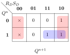
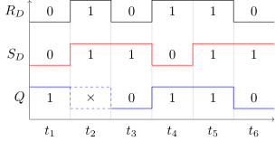

Flip-flop base element of sequential circuit, It can remain one
bit information by time according to its special structure.

# Component

RS-Flip flop is component by two **NAND** Gates with feedback:

We can write down its **Boolean Expression** easily by this
graphs:
$\begin{cases} P = \overline{R_DQ} \\\\ Q = \overline{S_DP} \end{cases}$

RS-flipflop have two inputs $R_D$, $S_D$, and two outputs
$P$, $Q$, we can list its truth table by calculate the boolean
expression:

| $R_D$ | $S_D$ | $P$  | $Q$  |
|:-----:|:-----:|:----:|:----:|
|   0   |   0   |  1   |  1   |
|   0   |   1   |  1   |  0   |
|   1   |   0   |  0   |  1   |
|   1   |   1   |  $\overline{Q}$ |  $\overline{P}$ |

When $R_D + S_D \neq 0$ (**bottom tree lines** in table),
we can get $P = \overline{Q}$ from its boolean expression and
truth table. Let $P$ be $\overline{Q}$, then we can get
this truth table, there we have not list output $P$:

| $R_D$ | $S_D$ | $P$  | $Q$  | Comment |
|:-----:|:-----:|:----:|:----:|:-------:|
|   0   |   0   |  1   |  1   | Invalid |
|   0   |   1   |  1   |  0   | Reset   |
|   1   |   0   |  0   |  1   | Set     |
|   1   |   1   |  $\overline{Q}$ |  $Q$ | Remain  |

Here we can get a explanation of inputs:

* $R_D$: low-level effective, used for *Resetting* value of flipflop
* $S_D$: low-level effective, used for *Setting* value of flipflop

Now we can list functions of R-S flipflop according above tables:

* When $R_D = 0, S_D = 0$, this is invalid input, because it
  will cause unstable result (We will [explain it later](#waveform-graphs))
* When $R_D = 0, S_D = 1$, it will reset $Q$ to $0$
* When $R_D = 1, S_D = 0$, it will set $Q$ to $1$
* When $R_D = 1, S_D = 1$, it will remain value of $Q$

Interesting! R-S flipflop is a **component that can remember
its output**.

# Methods to describe flipflop

## Truth Table / State Transition Table

When input signal changed, flip-flop can transform between stable status.

* Current Status: $Q^n$ $P^n$
* Next Status: $Q^{n+1}$ $P^{n+1}$

Now we can describe R-S flipflop using follow table:
| $R_D$ | $S_D$ | $Q^n$ | $Q^{n+1}$ |
|:-----:|:-----:|:-----:|:---------:|
| 0     | 0     | 0     | $\times$  |
| 0     | 0     | 1     | $\times$  |
| 0     | 1     | 0     | 0         |
| 0     | 1     | 1     | 0         |
| 1     | 0     | 0     | 1         |
| 1     | 0     | 1     | 1         |
| 1     | 1     | 0     | 0         |
| 1     | 1     | 1     | 1         |

The inputs are $R_D$, $S_D$ and current state $Q^n$, the
output is next status $Q^{n+1}$, so we can draw a 3-inputs
*Karnaugh Map* for it:

## Status Equation

Mark cells for Karnaough Map:

Then we can got its Status Equation:
$
\begin{cases}
Q^{n+1} &= \overline{S_D} + R_DQ^n & \\\\
R_D + S_D &= 1 &(Constraint)
\end{cases}
$

For $x$ is inputs and $Q^n$ is current state, $Q^{n+1}$ is next
state:

* Equation of Combinable Circuit: $Z = f(x)$
* Equation of Sequential Circuit: $Q_{n+1} = f(x, Q^n)$

## State Transition Diagram

* Circle: State (Value of $Q^n$ and $Q^{n+1}$)
* Label on Arrow: Transition cases
* Arrow: Transition direction (Arrow with $Q^n \rightarrow Q^{n+1}$)

This graphs is drawing according to its truth table:

| $R_D$ | $S_D$ | $Q^n$ $\rightarrow$ $Q^{n+1}$ |
|:-----:|:-----:|:------------------------------|
| 0     | 1     | 0     $\rightarrow$ 0         |
| 0     | 1     | 1     $\rightarrow$ 0         |
| 1     | 0     | 0     $\rightarrow$ 1         |
| 1     | 0     | 1     $\rightarrow$ 1         |
| 1     | 1     | 0     $\rightarrow$ 0         |
| 1     | 1     | 1     $\rightarrow$ 1         |

## Waveform Graphs

Why input with 0 0 cause unstable status when remain status.
* Explain with wave form

