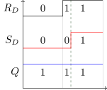
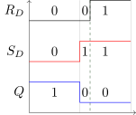

A flip-flop is a base element of a sequential circuit that can
restore one bit of information for a certain amount of time,
depending on its specific structure.

# Components

An *R-S flip flop* (also as known as a *Set-Reset Latch*)
is a component made up of two **NAND** gates with
feedback:

We can easily write down its **Boolean Expression** according its
structure:
$\begin{cases} P = \overline{R_DQ} \\\\ Q = \overline{S_DP} \end{cases}$

The R-S flip flop has two inputs, $R_D$ and $S_D$, and two
outputs, $P$ and $Q$, we can list its truth table by
calculating the Boolean expression:

| $R_D$ | $S_D$ | $P$  | $Q$  |
|:-----:|:-----:|:----:|:----:|
|   0   |   0   |  1   |  1   |
|   0   |   1   |  1   |  0   |
|   1   |   0   |  0   |  1   |
|   1   |   1   |  $\overline{Q}$ |  $\overline{P}$ |

When $R_D + S_D \neq 0$ (as seen in the **bottom tree lines** of
the table),
we can obtain $P = \overline{Q}$ from the Boolean expression and
truth table. If we let $P$ be $\overline{Q}$, we can create
this truth table without listing output $P$:

| $R_D$ | $S_D$ | $Q$  | Comment |
|:-----:|:-----:|:----:|:-------:|
|   0   |   0   |  1   | Invalid |
|   0   |   1   |  0   | Reset   |
|   1   |   0   |  1   | Set     |
|   1   |   1   |  $Q$ | Remain  |

Here's an explanation of the inputs:

* $R_D$: *Reset* signal, effective on **low-level**
* $S_D$: *Set* signal, effective on **low-level**

Now we can list functions of an R-S flipflop according to the
above truth table:

* When $R_D = 0, S_D = 0$, it is an invalid input, because it
  may cause an unstable result
  (We will [explain it later](#waveform-graphs))
* When $R_D = 0, S_D = 1$, it will reset $Q$ to $0$
* When $R_D = 1, S_D = 0$, it will set $Q$ to $1$
* When $R_D = 1, S_D = 1$, it will remain the current value
  of $Q$

Now we can obtain that an R-S flip flop is a basic memory
element in digital circuits, as it can retain its output value.
# Methods to describe flipflop

## Truth Table / State Transition Table

When the input signal changed, a flip-flop can transform between stable status.

* **Current Status**: $Q^n$ $P^n$
* **Next Status**: $Q^{n+1}$ $P^{n+1}$

Now we can describe the R-S flip-flop using the following table:

| $R_D$ | $S_D$ | $Q^n$ | $Q^{n+1}$ |
|:-----:|:-----:|:-----:|:---------:|
| 0     | 0     | 0     | $\times$  |
| 0     | 0     | 1     | $\times$  |
| 0     | 1     | 0     | 0         |
| 0     | 1     | 1     | 0         |
| 1     | 0     | 0     | 1         |
| 1     | 0     | 1     | 1         |
| 1     | 1     | 0     | 0         |
| 1     | 1     | 1     | 1         |

The inputs are $R_D$, $S_D$ and the current state $Q^n$, and the
output is the next status $Q^{n+1}$, so we can use a 3-inputs
*Karnaugh Map* to visualize the output logic:

## Status Equation

Marking the appropriate cells on the Karnaough Map:

We can obtain the Status Equation:
$
\begin{cases}
Q^{n+1} &= \overline{S_D} + R_DQ^n & \\\\
R_D + S_D &= 1 &(Constraint)
\end{cases}
$

Let $x$ represents the inputs and $Q^n$ represents the current
state. $Q^{n+1}$ is the next state:

* In a combinational circuit, the output is a function of only the current inputs: $Z = f(x)$
* In a sequential circuit, the output depends on both the current inputs and the current state: $Q_{n+1} = f(x, Q^n)$

## State Transition Diagram

* Circle: State (Value of $Q^n$ and $Q^{n+1}$)
* Label on Arrow: Transition cases
* Arrow: Transition direction ($Q^n \rightarrow Q^{n+1}$)

This graph is drawing according to its truth table:

| $R_D$ | $S_D$ | $Q^n$ $\rightarrow$ $Q^{n+1}$ |
|:-----:|:-----:|:------------------------------|
| 0     | 1     | 0     $\rightarrow$ 0         |
| 0     | 1     | 1     $\rightarrow$ 0         |
| 1     | 0     | 0     $\rightarrow$ 1         |
| 1     | 0     | 1     $\rightarrow$ 1         |
| 1     | 1     | 0     $\rightarrow$ 0         |
| 1     | 1     | 1     $\rightarrow$ 1         |

## Waveform Graphs

Why does the input of **00** will cause unstable status when
inputs jump to **11**? The reason is that we don't now the
accurate delay time of the logical gates. Let's recall the structure of an R-S flip flop:

The delay time of $R$ and $S$ is **uncertain**, delay time of 
$R$ may greater than $S$ or vice versa. Let's observe the
waveform when inputs **JUMP** from **00** to **11** while
considering delay time:

<table>
<td>
<tr>

</tr>
<tr>

</tr>
</td>
<table>

When $DELAY(R_D) \le DELAY(S_D)$, output $Q$ is 1. When
$DELAY(R_D) \ge DELAY(S_D)$, output $Q$ is 0. That's why the
input of **00** is invalid for an R-S flip-flop, because it
causes a different output when input jumps to **11**. 
